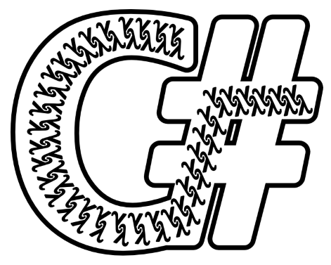
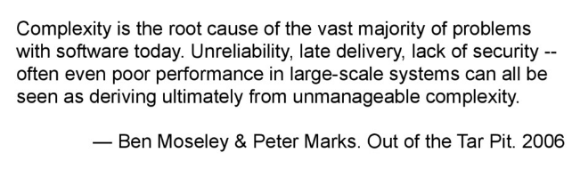

- title : Functional Patterns in C#
- description : Functional Patterns in C#
- author : Milosz Krajewski
- theme : beige
- transition : default

***

## Functional Patterns in C#



[github.com/MiloszKrajewski/dotnetcambridge-fx](https://github.com/MiloszKrajewski/dotnetcambridge-fx)

***

### About me

- Milosz Krajewski
- Full stack @ Newco
- first line of code written in ~1984
- C#, ES6, SQL
- C, C++, (Iron)Python, F#

---

### Background

- Algorithms
- Data Structures
- Algorithm Complexity
- Graph Theory
- Design Patterns

---

### Most recently

- Parallel
- Distributed
- Reactive
- Functional

***

### What are design patterns?

> [...] general reusable solution to a commonly occurring problem within a given context [...] -- **Wikipedia**

---

### What's wrong with OO design patterns?

- Are design patterns missing language features?
- Some patterns are actually anti-patterns
- Abuse of design patterns
- Design patterns are often too heavy

---

#### Are design patterns missing language features?

- Iterator (IEnumerator)
- Comparer (IComparer)

---

'Original' imperative iterator pattern:

	[lang=cs]
	var iterator = collection.GetEnumerator();
	while (iterator.MoveNext())
	{
		Console.WriteLine("item: {0}", iterator.Current);
	}

---

With 'foreach' feature:

	[lang=cs]
	foreach (var item in collection)
	{
		Console.WriteLine("item: {0}", item);
	}

---

Using 'extension method' and 'lambda' feature:

	[lang=cs]
	collection.ForEach(item => Console.WriteLine("item: {0}", item));

---

#### Pattern or anti-pattern?

- Singleton
- ServiceLocator

***

> "These days software is too complex. We can’t afford to speculate what else it should do. We need to really focus on what it needs." –- **Erich Gamma**

---



---

> "The problem with object-oriented languages is they've got all this implicit environment that they carry around with them. You wanted a banana but what you got was a gorilla holding the banana and the entire jungle." -- **Joe Armstrong**

---

> "[...] soon we had Mappers, Factories, MapperFactories, RepositoryFactories, MapperRepositoryFactories and MapperRepositoryFactoryFactories. Does this story sound familiar?" -- **Mark Seemann**, Functional Architecture with F#, Pluralsight

***

### Functional patterns are different

(so says Scott Wlaschin)

- No abstraction is too small
- Hide boilerplate code, expose business logic
- Functional patterns are unit of reusability
- Expressive and declarative

[Scott Wlaschin, Functional programming design patterns](https://vimeo.com/113588389)

---

### Expressive and declarative

Focus on intention not implementation.

Focus on **what** you are doing, not **how** you are doing it.

Do the same **what**, but using different **how**.

Reuse **how** for different **what**.

---

### What is wrong with 'how'?

	[lang=cs]
	X = X + Y;
	Y = X - Y;
	X = X - Y;

---

### Maybe we need comments?

	[lang=cs]
	X = X + Y; // add X and Y and store the result in X
	Y = X - Y; // subtract Y from X and store the result in Y
	X = X - Y; // subtract Y from X and store the result in X

---

### Let's try again using 'what'

	[lang=cs]
	Swap(ref X, ref Y);

---

### Focus on abstraction not implementation

Technically, it is very clear what it does:

	[lang=cs]
	if (portfolioIdsByTraderId[trader.Id].Contains(portfolio.Id))
	{
	    ...
	}

---

...although, I prefer this one:

	[lang=cs]
	if (trader.CanView(portfolio))
	{
	    ...
	}

[Kevlin Henney, Seven Ineffective Coding Habits of Many Programmers](https://vimeo.com/97329157)

***

### Functional patterns you already use


---

```csharp
T Reduce(this IEnumerable<T> collection, Func<T, T, T> reducer, T intial = default(T)) {
	var result = initial;
	foreach (var item in collection) {
		result = reducer(result, item);
	}
	return result;
}
```

---

### Sum

```csharp
numbers.Reduce((a, b) => a + b, 0);
```

---

### Product

```csharp
numbers.Reduce((a, b) => a * b, 0);
```

---

### Join (strings)

```csharp
strings.Reduce((a, b) => a + "," + b, 0);
```

---

### Build CSV

```csharp
ToLine(this IEnumerable<string> columns) =>
	columns.Reduce((a, b) => a + "," + b);
ToFile(this IEnumerable<IEnumerable<string>> rows) =>
	rows.Reduce((a, b) => a.ToLine() + "\n" + a.ToLine());
```

---

### Factorial

```csharp
Enumerable(1, value).Reduce((a, b) => a * b, 1);
```

***

### Functional design

#### You get some 'P's for free:

- Single Responsibility Principle
- Open/Closed Principle
- Liskov Substitution Principle
- Interface Segregation Principle
- Dependency Inversion Principle
- Reused Abstractions Principle
- Composite Reuse Principle

---

### Single Responsibility Principle

[...] class should have only a single resposibility [...]

---

### Open/Closed Principle

[...] open for extension, closed for modification [...]

---

### Liskov Substitution Principle

[...] formal, precise and verifiable interface specification [...]

---

### Interface Segregation Principle

[...] many client-specific interfaces, instead of one general-purpose interface [...]

---

### Dependency Inversion Principle

[...] depend on abstraction, not implementation [...]

---

### Reused Abstractions Principle

[...] abstraction is discovered not designed [...]

---

### Composite Reuse Principle

[...] composition over inheritance [...]


***

### Real-life example

Let's delete some folders:

```csharp
public void DeleteDirectoryTree(DirectoryInfo directory)
{
	foreach (var child in directory.GetDirectories())
	{
		DeleteDirectoryTree(child);
	}

	foreach (var file in directory.GetFiles())
	{
		file.Delete();
	}

	directory.Delete();
}
```

Let's call it 'business logic'.

Neat?

---

### Not so fast

...`directory.GetDirectories()` may throw exception.

First we need to take it out of `foreach`.

```csharp
var children = directory.GetDirectories();

foreach (var child in children)
{
	DeleteDirectoryTree(child);
}
```

---

We would also like to **Ignore** but **Log** first...

```csharp
DirectoryInfo[] children = null;
try
{
	children = directory.GetDirectories();
}
catch (Exception e)
{
	Trace.TraceError("{0}", e);
}
if (children != null)
{
	foreach (var child in children)
	{
		DeleteDirectoryTree(child);
	}
}
```

(find 'business logic')

---

...same with `directory.GetFiles()`...

```csharp
FileInfo[] files = null;
try
{
	files = directory.GetFiles();
}
catch (Exception e)
{
	Trace.TraceError("{0}", e);
}
if (files != null)
{
	foreach (var file in files)
	{
		file.Delete();
	}
}
```

(find 'business logic')

---

I think `file.Delete()` can definitely throw exception...

```csharp
if (files != null)
{
	foreach (var file in files)
	{
		try
		{
			file.Delete();
		}
		catch (Exception e)
		{
			Trace.TraceError("{0}", e);
		}
	}
}
```

(find 'business logic')

---

...as well as `directory.Delete()`...

```csharp
try
{
	directory.Delete();
}
catch (Exception e)
{
	Trace.TraceError("{0}", e);
}
```

(find 'business logic')

---

It would be useful if we could retry few times in case file is in use...

```csharp
try
{
	var count = 0;
	while (true)
	{
		count++;
		try
		{
			file.Delete();
			break; // if success
		}
		catch (Exception e)
		{
			if (count >= 5)
				throw;
			Trace.TraceWarning("{0}", e);
			Thread.Sleep(200);
		}
	}
}
catch (Exception e)
{
	Trace.TraceError("{0}", e);
}
```

(find 'business logic')

---

So, the whole solution got inflated ~6 times (11 lines vs 64 lines), with no value added.

If you look at source code (Solution2), in my opinion, you will agree that original feeling 'what this piece of code does' is lost.

***

### Functional approach

In C# `void` is not regular type, like in F#.

```csharp
typeof(Action) == typeof(Func<void, void>)
typeof(Action<T>) == typeof(Func<T, void>)
typeof(Func<T>) == typeof(Func<void, T>)
```

If it was, we would need only one implementation of many operators.

---

To avoid multiple implementations, we will 'cheat' with `Void` type...

```csharp
public sealed class Void
{
	public static readonly Void Instance = new Void();

	private Void() { }

	public override string ToString() { return "Void"; }
	public override bool Equals(object obj) { return obj is Void; }
	public override int GetHashCode() { return 0; }
}
```

---

...and some 'wrist saving' Fx class (proudly called Functional eXtensions)...

```csharp
public static class Fx
{
	public static readonly Void Void = Void.Instance;

	public static Func<Void> ToFunc(this Action action)
	{
		return () => {
			action();
			return Void;
		};
	}

	public static Func<T, Void> ToFunc<T>(this Action<T> action)
	{
		return t => {
			action(t);
			return Void;
		};
	}
}
```

---

We also don't like empty enumerables:

```csharp
public static IEnumerable<T> NotNull(this IEnumerable<T> collection)
{
	return collection ?? Enumerable.Empty<T>();
}
```

(yes, it just uses Enumerable.Empty but allowing type inference)

---

So, we were saying we want to 'forgive' some exceptions, **Ignore** but **Log** first:

```csharp
public static T Forgive<T>(this Func<T> func, T defaultValue = default(T))
{
	try
	{
		return func();
	}
	catch (Exception e)
	{
		Trace.TraceWarning("{0}", e);
		return defaultValue;
	}
}

public static void Forgive(this Action action)
{
	Forgive(action.ToFunc()); // wrist saving already...
}
```

---

So, recursive dive is changed from:

```csharp
foreach (var child in directory.GetDirectories())
{
	DeleteDirectoryTree(child);
}
```

...to:

```csharp
foreach (var child in Fx.Forgive(() => directory.GetDirectories()).NotNull())
{
	DeleteDirectoryTree(child);
}
```

---

...it could be actually:

```csharp
Fx.Forgive(() => directory.GetDirectories(), Enumerable.Empty<DirectoryInfo>())
```

...but I do like type inference.

---

Same thing with files:

```csharp
foreach (var file in Fx.Forgive(() => directory.GetFiles()).NotNull())
{
	Fx.Forgive(() => file.Delete());
}
```

...and folders:

```csharp
Fx.Forgive(() => directory.Delete());
```

---

`Retry` seems to be a little bit more complicated:

```csharp
public static T Retry<T>(
	Func<T> action, Func<int, TimeSpan, bool> retry, Action<TimeSpan> wait = null)
{
	var count = 0;
	var started = DateTimeOffset.Now;
	var exceptions = new List<Exception>();
	wait = wait ?? (_ => { });

	while (true) {
		count++;

		try {
			return action();
		}
		catch (Exception e) {
			Trace.TraceWarning("{0}", e);
			exceptions.Add(e);
		}

		var elapsed = DateTimeOffset.Now.Subtract(started);
		if (!retry(count, elapsed))
			break;
		wait(elapsed);
	}

	throw new AggregateException(exceptions);
}
```

---

...and we need alternative implementation for `Action`:

```csharp
public static void Retry(
	Action action, Func<int, TimeSpan, bool> retry, Action<TimeSpan> wait = null)
{
	Retry(action.ToFunc(), retry, wait);
}
```

---

Who is scared of 'Retry'?

```csharp
public static T Retry<T>(
	Func<T> action,
	int? retryCount = null, TimeSpan? retryTime = null, TimeSpan? interval = null)
{
	var retryCountValue = retryCount ?? int.MaxValue;
	var retryTimeValue = retryTime ?? TimeSpan.Infinity;
	var intervalValue = interval ?? 100;

	return Retry(
		action,
		(c, i) => c < retryCountValue && i < retryTimeValue,
		_ => Thread.Sleep(intervalValue));
}
```

---

...but the whole file deletion loop will look like this now:

```csharp
foreach (var file in Forgive(() => directory.GetFiles()).NotNull())
{
	Fx.Forgive(
		() => Fx.Retry(
			() => file.Delete(),
			(c, _) => c < 5,
			_ => Thread.Sleep(200)));
}
```

---

...which makes whole solution still fitting one page:

```csharp
public static void DeleteDirectoryTree(DirectoryInfo directory)
{
	foreach (var child in Fx.Forgive(() => directory.GetDirectories()).NotNull())
	{
		DeleteDirectoryTree(child);
	}

	foreach (var file in Fx.Forgive(() => directory.GetFiles()).NotNull())
	{
		Fx.Forgive(
			() => Fx.Retry(
				() => file.Delete(),
				(c, _) => c < 5,
				_ => Thread.Sleep(200)));
	}

	Fx.Forgive(() => directory.Delete());
}
```

---

...or with C#7 features:

```csharp
public static void DeleteDirectoryTree(DirectoryInfo directory)
{
	IEnumerable<DirectoryInfo> Children() =>
		Fx.Forgive(() => directory.GetDirectories()).NotNull();
	IEnumerable<FileInfo> Files() =>
		Fx.Forgive(() => directory.GetFiles()).NotNull();
	void DeleteFile(file: FileInfo) =>
		Fx.Forgive(() => Fx.Retry(
			() => file.Delete(), (c, _) => c < 5, _ => Thread.Sleep(200)));
	void DeleteThisFolder() => Fx.Forgive(() => directory.Delete());

	Children().ForEach(DeleteDirectoryTree);
	Files().ForEach(DeleteFile);
	DeleteThisFolder();
}
```

***

### Passing behaviour

Note, that behaviour modification like `Forgive` and `Retry` can be passed around and externally injected:

```csharp
public static void DeleteDirectoryTree(
	DirectoryInfo directory,
	Action<Action> directoryDeletionStrategy = null,
	Action<Action> fileDeletionStrategy = null)
{
	fileDeletionStrategy = fileDeletionStrategy ?? (a => a());
	directoryDeletionStrategy = directoryDeletionStrategy ?? (a => a());

	foreach (var child in Fx.Forgive(() => directory.GetDirectories()).NotNull())
	{
		DeleteDirectoryTree(child);
	}

	foreach (var file in Fx.Forgive(() => directory.GetFiles()).NotNull())
	{
		fileDeletionStrategy(() => file.Delete());
	}

	directoryDeletionStrategy(() => directory.Delete());
}
```

---

### Extract recursion

Actually, the whole recursion model here is a DFS/post-order algorithm:

```csharp
public static IEnumerable<T> RecursivelySelectMany<T>(
	this IEnumerable<T> collection,
	Func<T, IEnumerable<T>> selector)
{
	foreach (var item in collection)
	{
		foreach (var subitem in RecursivelySelectMany(selector(item), selector))
			yield return subitem;
		yield return item;
	}
}
```

---

The function to delete all files matching criteria in directory tree could be expressed as:

```csharp
public void DeleteFilesInTrees(
	IEnumerable<DirectoryInfo> roots)
{
	void PurgeFolder(directory: DirectoryInfo) {
		directory.SelectMany(Files).AsParallel().ForAll(DeleteFile);
		DeleteFolder(directory);
	}
	roots.RecursivelySelectMany(Chlidren).Lookahead().ForEach(Purge);
}
```
---

Where `Lookahead` is prefetching items in separate thread:

```csharp
public static IEnumerable<T> Lookahead<T>(
	this IEnumerable<T> collection, CancellationToken? token = null)
{
	token = token ?? CancellationToken.None;
	var queue = new BlockingCollection<T>(new ConcurrentQueue<T>());

	Task.Factory.StartNew(() => {
		try
		{
			collection.ForEach(i => queue.Add(i, token.Value));
		}
		finally
		{
			queue.CompleteAdding();
		}
	}, token.Value, TaskCreationOptions.LongRunning, TaskScheduler.Default);

	return queue.GetConsumingEnumerable(token.Value);
}
```

---

Even, if it is quite complex now, it has features which just would be a nightmare to implement in imperative code.

***

### Name the pattern


---

### Lazy

```csharp
public static Func<T> Lazy<T>(Func<T> factory)
{
	var variable = new Lazy<T>(factory);
	return () => variable.Value;
}
```

---

### Weak

```csharp
public static Func<T> Weak<T>(T value)
	where T: class
{
	var reference = new WeakReference(value);
	return () => (T)reference.Target;
}
```

---

### Cache

```csharp
public static Func<T> Cache<T>(Func<T> factory)
	where T: class
{
	var factorySync = new object();
	Func<T> reference = () => null;
	return () => {
		var value = reference();
		if (null == value)
		{
			lock (factorySync)
			{
				value = reference();
				if (null == value)
				{
					value = factory();
					reference = Weak(value);
				}
			}
		}
		return value;
	};
}
```

***

### Delay

```csharp
private static void Delay(
	int timeout, CancellationToken cancellationToken, Action action)
{
	var id = Guid.NewGuid();
	var timer = default(Timer);
	var ready = new ManualResetEventSlim(false);
	var handler = new TimerCallback(_ => {
		ready.Wait();
		ready.Dispose();

		try
		{
			Timer removed;
			var execute =
				!cancellationToken.IsCancellationRequested &&
				_timerMap.TryRemove(id, out removed); // assert true
			if (execute)
				action();
		}
		finally
		{
			timer.Dispose();
		}
	});

	timer = new Timer(handler, null, timeout, Timeout.Infinite);
	_timerMap.TryAdd(id, timer); // assert true
	ready.Set();
}
```

***

### Questions?

***

### Turn back!

***

### Don't go there!

***

### Told you!

***

Degrees of Freedom
Remove boilerplate, but don't be scared
Identify moving parts, cheaper to extract

Forgive
Retry


RecursivelySelectMany
Lookahead
Defer
Scope
Apply
Lazy
Weak
Pack/Unpack
Null
Unit
Curry
Partial
Match

Option
Result
